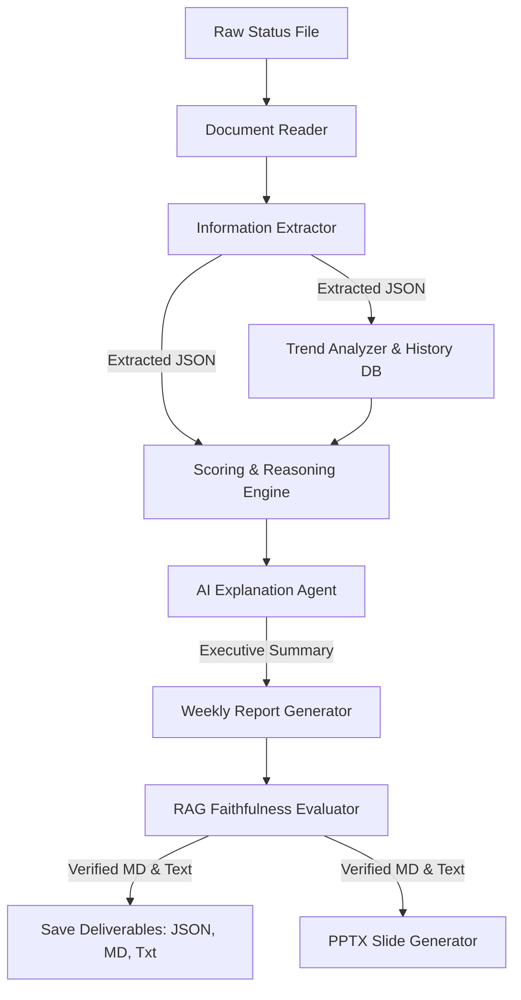

# 🛡️ Aegis Project Intelligence Agent

[](https://www.python.org/)
[](https://streamlit.io/)
[](https://pytest.org/)

Aegis is an enterprise-grade AI-powered **Project Health Reporting Agent** designed to automate PMO health scoring, weekly narrative generation, and monthly portfolio trend analysis. It extracts structured metrics from messy weekly status updates (PDF, DOCX, CSV, TXT, MD), calculates deterministic weighted health scores, generates executive narratives with data-integrity flags, audits faithfulness via a RAG evaluator, and exports deliverables as JSON, Markdown, PDF-ready plain text, and PowerPoint slide decks.

---

## 📖 Table of Contents
1. [Overview](#-overview)
2. [Architecture](#-architecture)
3. [Folder Structure](#-folder-structure)
4. [Methodology](#-methodology)
5. [Installation](#-installation)
6. [Running the Application](#-running-the-application)
7. [Example Input & Output](#-example-input--output)
8. [Future Improvements](#-future-improvements)

---

## 🔍 Overview

Managing enterprise projects involves parsing raw updates, cross-referencing timeline boundaries, auditing budget burn rates, and compiling reports. Aegis automates this end-to-end:

- **Modular Parser Interface**: Automatically detects and extracts raw text from multiple source file formats (PDF, DOCX, CSV, TXT, MD).
- **Rule-based Pydantic Extractor**: Extracts 13 critical fields (milestones, budgets, risks, blockers, stakeholder sentiment) with an offline regex fallback.
- **Weighted Health Scoring**: Calculates deterministic sub-scores for Schedule, Budget, Milestones, Risks, Sentiment, and Resource availability.
- **Narrative Explanation & PMO Warnings**: Compiles professional executive summaries and flags parameter gaps as explicit data uncertainties.
- **RAG Faithfulness QA**: Verifies the final report against source text to guarantee zero hallucinations.
- **Automated PPTX Slide Generation**: Builds weekly project updates and monthly 6-slide executive portfolio decks.
- **Interactive Dashboard**: Streamlit interface with uploaders, Plotly metrics visualization, and a document download hub.

---

## 🏗️ Architecture

Aegis follows a decoupled pipeline design:



---

## 📂 Folder Structure

```
Project-Health-Agent/
├── agents/                      # Pipeline Agent Modules
│   ├── __init__.py              # Exposed Imports
│   ├── document_reader.py       # Phase 1: PDF, DOCX, CSV, TXT parser
│   ├── information_extractor.py # Phase 2: Schema models & LLM/Regex extraction
│   ├── trend_analyzer.py        # Historical report delta tracker
│   ├── reasoning_agent.py       # Phase 3 & 4: Scoring Engine & AI Explanation Agent
│   ├── weekly_report_generator.py # Phase 5: Pipeline Orchestrator
│   ├── ppt_generator.py         # Phase 7: Weekly & Portfolio PPTX Builders
│   └── rag_evaluator.py         # Phase 6: Faithfulness QA Auditor
├── config/                      # Parameter and Prompt Registries
│   ├── scoring_config.yaml      # Category weights and penalty thresholds
│   ├── rag_rules.yaml           # Hallucination checking guidelines
│   └── prompts.py               # Prompt Loader & Fallbacks
├── data/                        # Workspace File Stores
│   ├── input/                   # Staged upload updates
│   └── processed/               # Database of weekly JSON records
├── outputs/                     # Final Executive Deliverables
│   ├── weekly_reports/          # Markdown, JSON, PDF-ready plain text
│   └── presentations/           # PowerPoint presentations (.pptx)
├── templates/                   # Document Formatting Layouts
│   ├── prompts/                 # LLM Prompt Templates (extraction, explanation, portfolio)
│   ├── report_template.md       # Weekly Markdown Layout
│   └── ppt_template.pptx        # PowerPoint Base Template (fallback to blank)
├── tests/                       # Unit Test Suites
│   ├── test_document_reader.py
│   ├── test_information_extractor.py
│   ├── test_scoring_engine.py
│   ├── test_explanation_agent.py
│   ├── test_weekly_report_generator.py
│   ├── test_portfolio_analyzer.py
│   └── test_portfolio_ppt_generator.py
├── app.py                       # Phase 8: Streamlit Dashboard Frontend
├── requirements.txt             # Project Dependencies
└── README.md                    # System Documentation
```

---

## 🧪 Methodology

### 1. Extracted Fields Schema
Aegis parses raw text into a 13-field Pydantic schema:
1. `project_name`
2. `planned_start_date`
3. `planned_end_date`
4. `current_progress`
5. `budget`
6. `budget_spent`
7. `milestones`
8. `delayed_milestones`
9. `open_risks`
10. `blockers`
11. `stakeholder_comments`
12. `dependencies`
13. `resource_availability`

### 2. Weighted Scoring Formula
Overall project health is a weighted average of 6 key categories:
- **Schedule (30%)**: Compares actual progress with elapsed timeline ratio (computed from start/end dates).
- **Budget (20%)**: Applies overrun penalties based on actual spend vs. baseline.
- **Milestones (20%)**: Penalizes the ratio of delayed milestones.
- **Risks (15%)**: Subtracts points for blockers and risk severity levels.
- **Sentiment (10%)**: Performs case-insensitive keyword scans on stakeholder comments.
- **Resources (5%)**: Checks resource logs for availability shortages.

### 3. RAG Faithfulness QA
Before saving, Aegis audits the generated markdown text against the raw input source using a dual-clause prompt, computing a correctness ratio (0.0 - 1.0) and issuing a verdict:
- **Faithfulness >= 0.85**: `PASSED`
- **Faithfulness < 0.85**: `FAILED` (flags warnings to the PMO)

---

## ⚙️ Installation

1. **Clone the Repository**:
   ```bash
   git clone <repository_url>
   cd Project-Health-Agent
   ```

2. **Set up Virtual Environment**:
   ```bash
   python3 -m venv venv
   source venv/bin/activate
   ```

3. **Install Dependencies**:
   ```bash
   pip install -r requirements.txt
   ```

4. **Configure API Keys (Optional)**:
   Aegis runs perfectly offline. For LLM narrative processing, set environment keys:
   ```bash
   export GEMINI_API_KEY="your_gemini_key"
   export OPENAI_API_KEY="your_openai_key"
   ```

---

## 🚀 Running the Application

### Running the Web Dashboard
Launch the Streamlit dashboard on your local server:
```bash
streamlit run app.py
```
Open [http://localhost:8501](http://localhost:8501) in your browser.

### Running Unit Tests
Aegis has 25 unit tests covering document parsing, regex extraction, health scoring, explanation builders, portfolio trends, and PPTX slide generation:
```bash
PYTHONPATH=. pytest
```

---

## 📝 Example Input & Output

### Example Input (`weekly_update.txt`)
```text
Project: Apollo Launch
Start Date: 2026-05-01
End Date: 2026-10-01
Progress: 35%
Budget: $250,000.00
Spent: $120,000.00

### Milestones
* Phase 1 Definition | 2026-06-01 | Completed
* Core API Architecture | 2026-07-05 | Delayed

### Blockers
* Staging environment credentials not issued
```

### Example Output (`apollo_launch_report_pdf_ready.txt`)
```text
================================================================================
                        🛡️ AEGIS EXECUTIVE WEEKLY REPORT
Project Name: Apollo Launch
Date:         2026-07-10
================================================================================

  Project Name: Apollo Launch
  Date:         2026-07-10
  RAG Status:   YELLOW (Weighted Score: 72.2/100)
  Confidence:   100.0%
  Missing Data: None. All parameters extracted successfully.

--------------------------------------------------------------------------------
                         1. METRIC CATEGORY SCOREBOARD
--------------------------------------------------------------------------------
  * SCHEDULE       :  62.2/100  [YELLOW]
  * BUDGET         : 100.0/100  [GREEN]
  * MILESTONES     :  50.0/100  [YELLOW]
  * RISKS          :  75.0/100  [YELLOW]
  * SENTIMENT      :  80.0/100  [GREEN]
  * RESOURCES      : 100.0/100  [GREEN]

--------------------------------------------------------------------------------
                                   2. SUMMARY
--------------------------------------------------------------------------------
Project Apollo Launch health is calculated as YELLOW (score 72.2/100) with 100.0% data confidence.

--------------------------------------------------------------------------------
                                  3. REASONING
--------------------------------------------------------------------------------
The overall health status of **Apollo Launch** is evaluated as **YELLOW** (weighted score: **72.2/100**). This rating is driven by the following parameters: the schedule is experiencing pressure due to progress lag (score: 62.2/100), the budget remains within baseline parameters, and key milestones are facing delays (score: 50.0/100). Additionally, multiple active risk items or blockers have been logged (score: 75.0/100), stakeholder sentiment remains positive, and resource availability is adequate.

--------------------------------------------------------------------------------
                               4. RECOMMENDATIONS
--------------------------------------------------------------------------------
1. Conduct a schedule recovery workshop to align actual progress with the planned timeline.
2. Assign dedicated task owners to recover delayed milestones.
3. Prioritize blocker resolution and update mitigation paths for critical risks.
```

---

## ⏰ Automated Execution Scheduler

Aegis includes a dedicated scheduler script `scheduler.py` to automate audits of staged project plans in `data/input`.

### Configuration
Scheduler triggers and timings are configured in [scheduler_config.yaml](file:///Users/soumyajithazra/Documents/Project%20Health%20Ai/Project-Health-Agent/config/scheduler_config.yaml):
- `input_directory`: folder to scan for status files (default: `data/input`).
- `schedule.daily_time`: daily run-time (e.g. `"08:00"`).
- `schedule.weekly_day` & `schedule.weekly_time`: weekly run day and time (e.g. `"friday"`, `"17:00"`).

### CLI Triggers
Run the scheduler using one of the following commands depending on execution context:

*   **Immediate Run-Once Sweep**:
    Process all staged updates in `data/input` immediately, compile deliverables (JSON, Markdown, PDF-ready text, PPTX slides), write trends, and exit:
    ```bash
    python scheduler.py --run-once
    ```

*   **Daily Repeating Daemon**:
    Start the service to run daily at the configured trigger time (remains running in blocking loop):
    ```bash
    python scheduler.py --daily
    ```

*   **Weekly Repeating Daemon**:
    Start the service to run weekly on the configured day and time (remains running in blocking loop):
    ```bash
    python scheduler.py --weekly
    ```

### Execution Logs
All scheduler outputs, sweeps metadata, successfully completed file processing status, and exception traces are appended to `logs/scheduler.log`.

---

## 🔮 Future Improvements

1. **Automated PDF Converter**: Integrate HTML-to-PDF compilers (e.g. `weasyprint`) to export high-fidelity PDF documents directly.
2. **Database Integration**: Connect the processed data files to SQL or Vector databases (e.g. PostgreSQL, ChromaDB) to support conversational status queries.
3. **Notification Hooks**: Set up email, Slack, or Microsoft Teams webhook integrations to alert project owners immediately when RAG turns RED.

